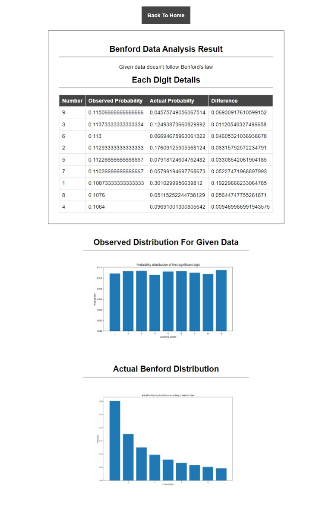

## Benford Data Analysis
This is a simple data engineering project using Pyramid framework of Python. Here, I have developed a simple web app in which user can upload a dataset and check if the dataset follows Benford's law or not.

### Developed By ~ **Anish Shilpakar**

## Features of web app
1. User can upload csv data from the form
2. User can get the JSON output for the given input
3. User can also get detailed results in Analysis page with tabular comparison and graph visualization

## Tools Used
- Python
- Pyramid Framework
- HTML/CSS

## Demo Video

https://user-images.githubusercontent.com/43902648/233802125-8b5ad344-f7db-4a42-a6a5-645e8c03bb07.mp4

## Screenshots
### Input Form

### JSON Output for Correct Data

### JSON Output for Incorrect Data

### Analysis Results for Correct Data

### Analysis Results for Incorrect Data

## About Benford's law
 - In any dataset if we take the first digit of all the rows, the most frequenct 1st digit will be 1 and the frequency decreases gradually. The weird thing is that it is correct for almost all the naturally occuring data.
- Benford’s law describes the relative frequency distribution for leading digits of numbers in datasets. Leading digits with smaller values occur more frequently than larger values. This law states that approximately 30% of numbers start with a 1 while less than 5% start with a 9. According to this law, leading 1s appear 6.5 times as often as leading 9s! Benford’s law is also known as the First Digit Law.

 - However it may not work for height data, CGPA data etc.
 - Check this [YT Video](https://www.youtube.com/watch?v=oH1ZF0OOf-c)
 - And this [Blog](https://statisticsbyjim.com/probability/benfords-law/)
 - Used mostly in digital forensics, anomaly detection, fraud detection
